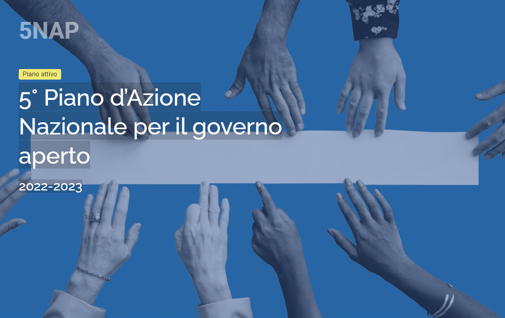

> La partecipazione dell'Italia all'[Open Government Partnership](https://www.opengovpartnership.org/) è assicurata dalla Presidenza del Consiglio dei Ministri – Dipartimento della Funzione Pubblica (DFP), in veste di Governo italiano. Tale ruolo comporta l'impegno a **promuovere** e **attuare** i **principi del governo aperto** a livello nazionale, attraverso la definizione e attuazione dei **Piani d'Azione Nazionale** (NAP).

È in corso l'attuazione del [**5° Piano d'Azione Nazionale per il governo aperto 2022-2023**](https://open.gov.it/governo-aperto/piano-nazionale/5nap#i-contenuti-del-5nap) (5NAP), un processo di co-creazione che ha visto la collaborazione tra tutti gli _stakeholders_ pubblici e privati interessati alle politiche di governo aperto.

## L'azione 5 del piano

L'**azione 5** ha per titolo "**Innovazione digitale inclusiva**":

> l'innovazione digitale è il principio su cui si basano le politiche di governo aperto ed è l'intervento essenziale e trasversale a tutti gli altri principi: trasparenza, partecipazione civica, lotta alla corruzione, _accountability_.

È suddiviso in diversi impegni, di cui il 5.02 è denominato "[**Standard aperti per l'inclusività e la partecipazione della società civile nel monitoraggio della spesa pubblica**](https://open.gov.it/governo-aperto/piano-nazionale/5nap/azione-5/impegno-502)".

### Qual è il problema che l'impegno affronterà?

> I cittadini e le organizzazioni della società civile **lamentano la carenza di fonti di dati aperte e fruibili per monitorare la spesa pubblica in maniera capillare**. I dati condivisi dalle pubbliche amministrazioni sono spesso pubblicati sotto forma di indicatori, in forma aggregata o seguendo schemi particolari che replicano i formati di raccolta o derivano dalle esigenze particolari dell'amministrazione che li raccoglie: a volte è difficile collegare dati provenienti da diverse amministrazioni, confrontarli con fonti aperte o commerciali o con quelli di altri paesi.
>
> Il problema è reso ancora più grave dal quadro di bassa alfabetizzazione digitale esistente nel nostro paese, che impedisce una piena fruizione delle fonti di dati pubbliche anche quando queste esistono e sono disponibili e più in generale non favorisce l'inclusione della società civile in processi di analisi e monitoraggio. Il superamento di questo problema costituisce un fattore abilitante per un'innovazione digitale inclusiva.

### In che modo l'impegno contribuirà a risolvere il problema?

> L'adozione di formati standard e regole comuni per la pubblicazione dei dati sugli appalti, sia a livello nazionale che europeo, favorisce il coinvolgimento della società civile nel monitoraggio della spesa pubblica ed il confronto con quanto avviene in altri paesi. L'utilizzo di standard condivisi favorirà l'analisi delle iniziative inserite nel PNRR.
>
> Si può quindi prevedere un doppio livello di soluzione del problema prospettato nella precedente sezione: il processo di standardizzazione favorisce l'interoperabilità e la possibilità di collegare fonti di dati diverse; l'adozione di uno standard maturo e diffuso a livello internazionale crea le condizioni per il monitoraggio ed il confronto con altri paesi e la semplificazione derivante dall'adozione di un formato unico e ben documentato quale OCDS dovrebbe ridurre le barriere di ingresso per i processi di governance partecipativa, favorendo così lo sviluppo di competenze da parte di cittadini ed imprese e l'innovazione digitale inclusiva.

